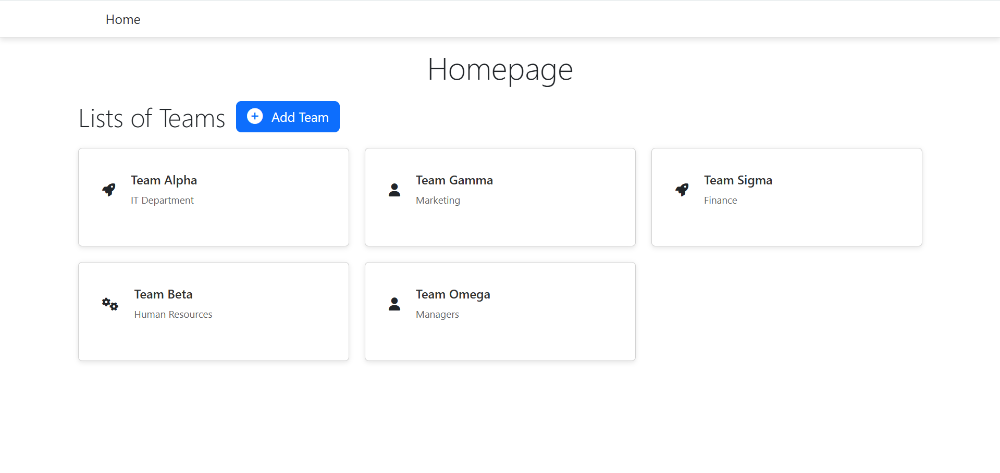
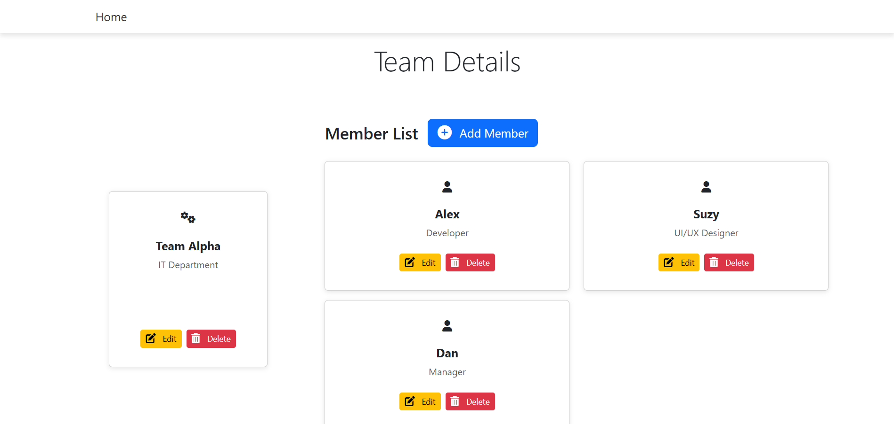

# team-management-fe

This project is created using Ember.js framework. This project is the frontend side for managing teams and their members. The application interacts with a Loopback API [Team Management App - Backend](https://github.com/Firmanrachmad/team-management-BE) to fetch and manage data related to teams and members.

## Features

- **Team Management**: Create, read, update, and delete teams.
- **Member Management**: Create, read, update, and delete members within teams.
- **Data Fetching**: The application fetches data from a Loopback API.

## Approach

* **Components**: Reusable components were created to manage the UI for teams and members.
* **Routes**: Routes were set up to handle navigation between different views (e.g., listing teams, adding a new team).
* **Templates**: Handlebars templates were used to render the UI, with data binding to dynamically display team and member information.
* **Data Fetching**: The application fetches data from a Loopback API.

## Screenshot

Here’s a screenshot of the application in action:

## Prerequisites

You will need the following things properly installed on your computer.

* [Git](https://git-scm.com/)
* [Node.js](https://nodejs.org/) (with npm)
* [Ember CLI](https://ember-cli.com/)
* [Google Chrome](https://google.com/chrome/) (or any modern web browser)

## Installation

* `git clone https://github.com/Firmanrachmad/team-management-FE.git`
* `cd team-management-fe`
* `npm install`

## Running / Development

* `ember serve`
* Visit your app at [http://localhost:4200](http://localhost:4200).
* Visit your tests at [http://localhost:4200/tests](http://localhost:4200/tests).

### Code Generators

Make use of the many generators for code, try `ember help generate` for more details

### Running Tests

* `ember test`
* `ember test --server`

### Linting

* `npm run lint`
* `npm run lint:fix`

### Building

* `ember build` (development)
* `ember build --environment production` (production)

### Deploying

To deploy this application, you can use any static hosting service (e.g., Netlify, Vercel, or GitHub Pages). Ensure that the production build is used for deployment.

## Further Reading / Useful Links

* [ember.js](https://emberjs.com/)
* [ember-cli](https://ember-cli.com/)
* Development Browser Extensions
  * [ember inspector for chrome](https://chrome.google.com/webstore/detail/ember-inspector/bmdblncegkenkacieihfhpjfppoconhi)
  * [ember inspector for firefox](https://addons.mozilla.org/en-US/firefox/addon/ember-inspector/)
